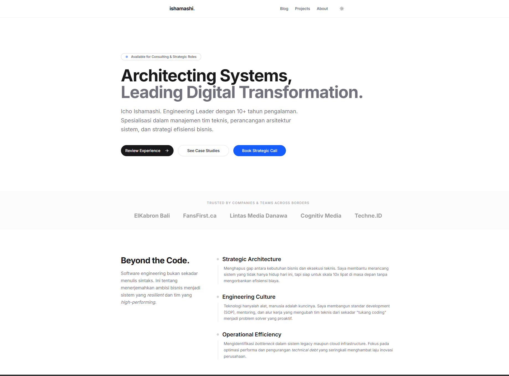

# ishamashi.com


[](https://nextjs.org/)
[](https://www.typescriptlang.org/)
[](https://tailwindcss.com/)
[](https://vercel.com/)

> **The Digital Headquarters of Icho Ishamashi.**
> 
> *Engineering Lead & Technical Consultant.*

This repository houses the source code for my personal portfolio and knowledge base. It marks a strategic shift from a "Developer Portfolio" to a "Consultant's Digital Garden," focusing on high-level architecture, business value, and engineering philosophy.

## 🏗 Architecture & Tech Stack

Built with a focus on **Radical Simplicity** and **SEO Performance**. No heavy client-side frameworks, just pure server-side rendered content where possible.

- **Framework:** [Next.js 15 (App Router)](https://nextjs.org/) - Leveraging React Server Components (RSC).
- **Styling:** [Tailwind CSS](https://tailwindcss.com/) + [Shadcn/ui](https://ui.shadcn.com/) for a clean, editorial aesthetic.
- **Content Engine:** MDX (Markdown + JSX) powered by `next-mdx-remote`.
- **Typography:** Inter (Sans) & JetBrains Mono (Code).
- **Deployment:** Vercel (Edge Network).

## ⚡ Key Features

- **Editorial Layout:** A minimalist design system inspired by premium editorial magazines, removing "Agency-style" clutter.
- **MDX Blog Engine:** Write content in Markdown, render React components inside articles.
- **Syntax Highlighting:** Beautiful code blocks using `rehype-pretty-code` (VS Code theme).
- **Dark Mode:** System-aware theme switching via `next-themes`.
- **SEO Optimized:** Auto-generated `sitemap.xml`, `robots.txt`, and dynamic Open Graph images.
- **Responsive:** Mobile-first design for all viewports.

## 📂 Project Structure

```bash
├── app/                  # Next.js App Router
│   ├── blog/             # Blog listing & detail pages
│   ├── projects/         # Project showcase pages
│   └── layout.tsx        # Root layout (Navbar, Footer, SEO)
├── components/           # React Components
│   ├── ui/               # Shadcn UI primitives (Button, Card, etc.)
│   └── ...               # Custom components (Navbar, ModeToggle)
├── content/              # The Database (MDX Files)
│   ├── posts/            # Blog articles
│   └── projects/         # Case studies & portfolio items
├── lib/                  # Utilities (MDX parsers, formatters)
└── public/               # Static assets
```

## 🚀 Getting Started

To run this project locally:

1.  **Clone the repository**

    ```bash
    git clone [https://github.com/ishamashi/ishamashi-web.git](https://github.com/ishamashi/ishamashi-web.git)
    cd ishamashi-web
    ```

2.  **Install dependencies**

    ```bash
    npm install
    ```

3.  **Run the development server**

    ```bash
    npm run dev
    ```

4.  **Open locally**
    Visit [http://localhost:3000](https://www.google.com/search?q=http://localhost:3000).

## 📝 Content Management

Content is managed via the `content/` directory.

  - To add a **Project**: Create a `.mdx` file in `content/projects/`.
  - To add a **Blog Post**: Create a `.mdx` file in `content/posts/`.

**Frontmatter Example:**

```yaml
---
title: "Project Title"
publishedAt: "2025-01-01"
summary: "A brief description for SEO and preview cards."
techstack: ["Next.js", "Python"]
tags: ["Ventures", "Enterprise"]
impact: ["Reduced costs by 40%", "Scaled to 1M users"]
---
```

## 🤝 Contribution & License

This project is open-sourced under the **MIT License**.
Feel free to fork and use it as a template for your own portfolio, but please credit the original author.

-----

### "Code is a liability. Value is the asset."

**[Icho Ishamashi](https://ishamashi.com)** *Forging Logic into Digital Reality.*
